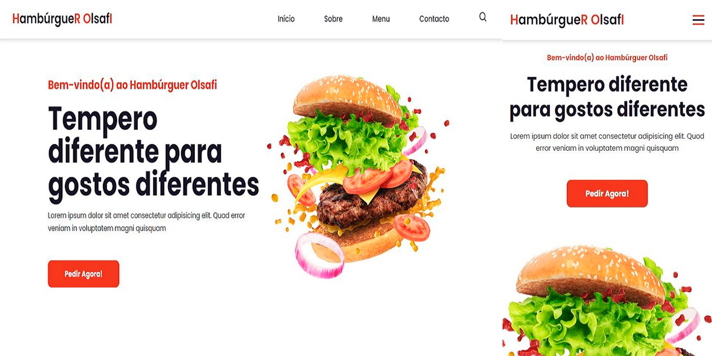

# Landing Page Responsiva

## Sobre o projecto
 

Landing Page Responsiva para Hamburgueria em HTML, CSS e JS.

Landing Page responsiva para uma hamburgueria, utilizando as linguagens HTML, CSS e JavaScript. A página foi projetada para se adaptar a diferentes tamanhos de tela, proporcionando uma experiência de usuário otimizada em dispositivos móveis, tablets e desktops.
